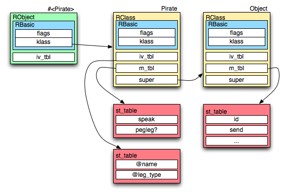

!SLIDE subsection

# Object Model #

!SLIDE

# Classes and Objects #

	@@@ ruby
	class Canadian < Object
	  def speak
	    puts "eh?"
	  end	  
	end

	Canadian.new.speak
	# eh?

!SLIDE

# Simple Inheritance#

	@@@ ruby
	class Winnipegger < Canadian
	  def speak
	    puts "brrr..."
	  end	  
	end

	Canadian.new.speak
	# eh?
	Winnipegger.new.speak
	# brrr...

!SLIDE

# Simple Inheritance #

Diagram of object model for that example goes here. Winnipegger ->
Canadian -> Object

!SLIDE

# Singleton Methods #

	@@@ruby
	newfie = Canadian.new
	def newfie.speak
	  "[untranscribable], eh?"
	end
	newfie.speak
	# [untranscribable], eh? 

!SLIDE 

# What is a class? #

	@@@c
	/* As of ruby-1.8.7 */
	struct RBasic {
	    unsigned long flags;
	    VALUE klass;
	};
	struct RObject {
	    struct RBasic basic;
	    struct st_table *iv_tbl;
	};
	struct RClass {
	    struct RBasic basic;
	    struct st_table *iv_tbl;
	    struct st_table *m_tbl;
	    VALUE super;
	};

!SLIDE bullets

# Aren't Classes Objects? #

* Short answer: **YES**.
* Über-technically: **NO**.
* As far as you can tell from ruby code: **YES**.

!SLIDE

# Aren't Classes Objects? #

	@@@
	~/src/ruby ▸ grep -ne '^struct R' ruby.h
	318:struct RBasic {
	323:struct RObject {
	328:struct RClass {
	341:struct RFloat {
	349:struct RString {
	362:struct RArray {
	374:struct RRegexp {
	383:struct RHash {
	395:struct RFile {
	400:struct RData {
	430:struct RStruct {
	438:struct RBignum {

!SLIDE center

# Diagrams! #

